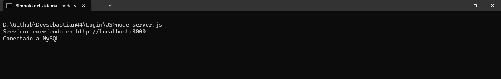

# Login

Este es un login con base de datos que registra los usuarios nuevos y verifica a los usuarios registrados. 

Primero instalamos las dependencias

```javascript
npm install express mysql bcrypt jsonwebtoken body-parser dotenv
```

Luego para correr el servidor en JS importamos primero la base de datos en MySQL luego corremos el servidor con Node.js


```javascript
node server.js
```



Luego de esto podremos registrarnos o iniciar sesión en la web.