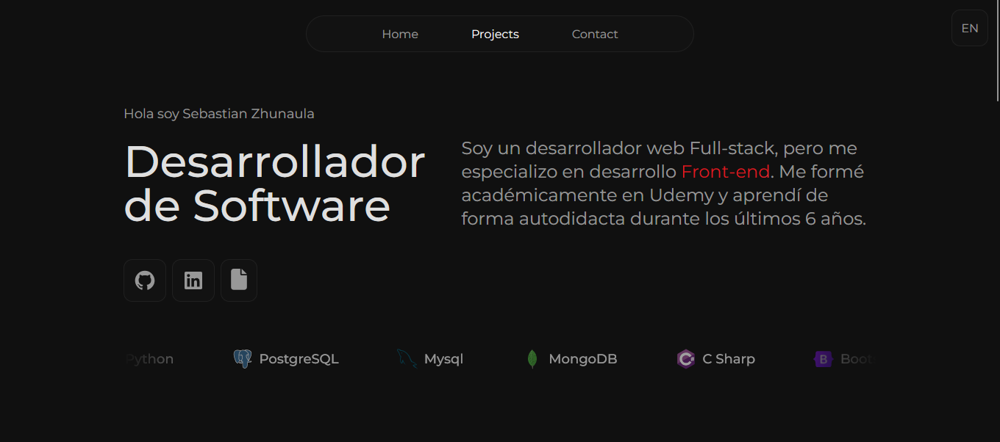
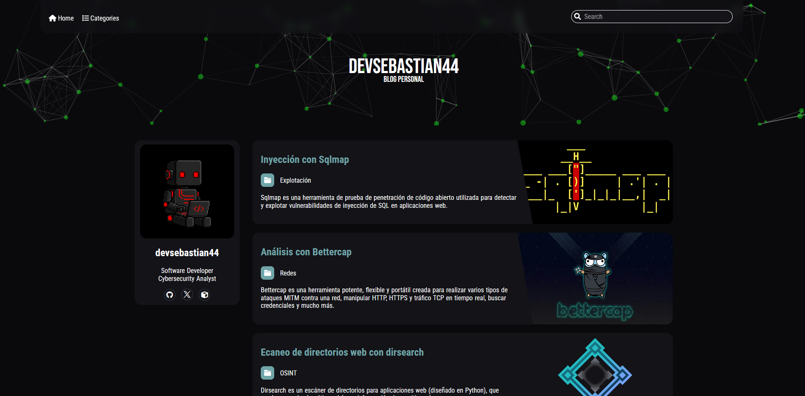
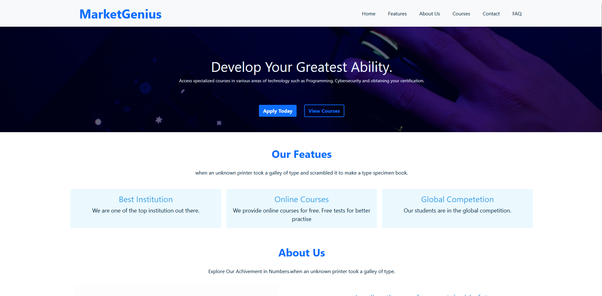

## Portafolio de Proyectos

Bienvenido a mi portafolio. Aquí encontrarás todos los proyectos en los que he trabajado, incluyendo desarrollos en Python, sitios web, herramientas de ciberseguridad y más.

---

## 🗂️ Proyectos destacados

### 🔧 Repositorio de proyectos en Python

Colección de scripts y herramientas desarrolladas en Python.  
Cada carpeta contiene su propio README explicativo.

📁 [Ver repositorio](https://github.com/Devsebastian44/Proyectos-python)

---

### 🛡️ Blog de Ciberseguridad

Sitio web dedicado a temas de hacking ético, análisis de malware, herramientas ofensivas y defensivas.  
Incluye artículos técnicos, tutoriales y recursos educativos.

🌐 [Ir al blog](https://devsebastian44-blog.netlify.app)

---

### 🎓 MarketGenius

Plataforma educativa con cursos sobre programación, ciberseguridad y herramientas prácticas.  
Diseñada para facilitar el aprendizaje técnico desde cero.

🌐 [Visitar MarketGenius](https://marketgeniuseducation.netlify.app)

---

## 📬 Contacto

Si deseas colaborar, hacer sugerencias o simplemente conversar sobre tecnología, puedes encontrarme en:

- GitHub: [Devsebastian44](https://github.com/Devsebastian44)
- Blog: [devsebastian44-blog.netlify.app](https://devsebastian44-blog.netlify.app)
- MarketGenius: [marketgeniuseducation.netlify.app](https://marketgeniuseducation.netlify.app)

---

## 📜 Licencia

Este portafolio está bajo la licencia MIT.  
Puedes usar los recursos libremente con fines educativos y de investigación.